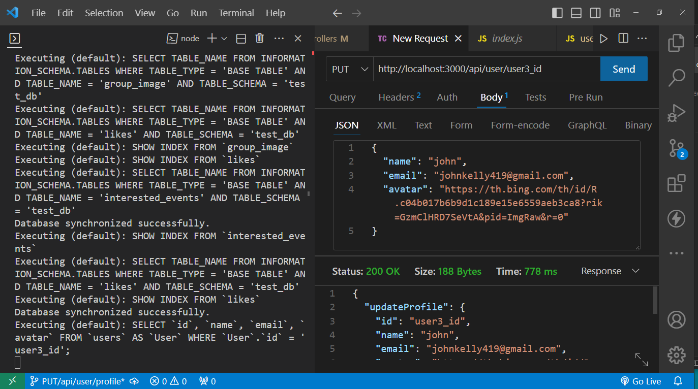

# EVENTS APP BACKEND

Backend for the events mobile app. Built as part of the HNGx Internship by team fortress.

## 🔧 Tech Stack

- NodeJS
- ExpressJS
- MySQL

## 📝 Requirements

This project requires nodeJS version >= 14 and npm package manager.

## 📁 Project Configuration

The project is divided into:

- Controller: found in `src/controller` folder. Coordinates the interaction between the UI and the backend services.
- Middlewares: found in `src/middlewares` folder. Logic to process incoming HTTP requests and perform tasks such as authentication, validation, etc.
- Model: found in `src/model` directory. Database Schema of the events app.
- Routes: found in `src/routes` directory. URL endpoints and their corresponding method/action.

## 💻 Running Locally

1. Clone this repository by running:
   ```bash
   git clone https://github.com/hngx-org/Fortress-events-backend
   cd Fortress-events-backend
   ```
2. Install the dependencies:
   ```bash
   npm install
   ```
3. Using the `.env_sample` template, create a `.env` file and fill in the values for each environment variables.
4. Start the server in dev mode:
   ```bash
   npm run build
   ```

## 🗃️ Database SetUp

This project uses MySQL for the database. Database Schema can be found in the Documentation section.
**NOTE**: You need to setup a MySQL instance yourself, the default database name is: `fortress_db`. DB schemas are automatically synced

### Installing MySQL

- Linux
  ```bash
  sudo apt update
  sudo apt install mysql-server
  ```
- Windows
  Read on the installation process [here](https://dev.mysql.com/downloads/installer/)

### Starting the MySQL Service

```bash
sudo systemctl start mysql
sudo mysql
```

Then:

```sql
CREATE USER 'fortress'@'localhost' IDENTIFIED BY 'f0rtr355';

GRANT ALL PRIVILEGES ON *.* TO 'fortress'@'localhost' WITH GRANT OPTION;

FLUSH PRIVILEGES;

exit
```

## 🌐 Endpoints

- POST `/api/users/register` -> User registration
- POST `/api/users/login` -> User login
- GET `/api/users/profile` -> Get user profile
- PUT `/api/users/profile` -> Update user profile
- POST `/api/events` -> Create a new event
- GET `/api/events` -> Get a list of events
- GET `/api/events/:eventId` -> Get event details
- PUT `/api/events/:eventId` -> Update event details
- DELETE `/api/events/:eventId` -> Delete and event
- POST `/api/events/:eventId/comments` -> Add a comment to an event
  GET `/api/events/:eventId/comments` -> Get comments for an event
- POST `/api/comments/:commentId/images` -> Add an image to a comment
- GET `/api/comments/:commentId/images` -> Get images for a comment
- POST `/api/users/:userId/interests/:eventId` -> Express interest in an event
- DELETE `/api/users/:userId/interests/:eventId` -> Remove interest in an event
- POST `/api/groups` -> Create a new group
- GET `/api/groups/:groupId` -> Get group details
- PUT `/api/groups/:groupId` -> Update group details
- DELETE `/api/groups/:groupId` -> Delete a group
- POST `/api/groups/:groupId/members/:userId` -> Add a user to a group
- DELETE `/api/groups/:groupId/members/:userId` -> Remove a user from a group

## 📩 Requests

- Accepts JSON only.
- Request body should **only** contain the specified values and follow the database schema.
- Example request:
  ```json
  {
    "name": "John Doe"
  }
  ```

## 📂 Response

Returns JSON.

## ⚠️ Response Status

- 200 - OK: User or resource has been successfully updated.
- 201 - Created: User or resource has been successfully created.
- 400 - Bad Request:
  - Request body has more than the specified attribute.
  - Invalid content-Type.
- 403 - Unauthorized: A user is not authenticated
- 404 - User or Resource Not Found.
- 500 - Internal Server Error.

## 💻 Testing

Tests can be carried out locally by running:

```bash
npm run test
```

Alternatively, online API testing tools such as Postman can be used to test the endpoints.

## 📄 License

This project uses the MIT License as found in [LICENSE](/LICENSE)

## 📖 Documentation

Documentation can be found [here](/)

## 🔗 Links

[Server URL]()

[Database Schema]()

## 🤝 The Team

Built by team fortress. Team members can be found at [AUTHORS](/AUTHORS)

# updating a specific user profile



the above image shows the response after make a put request to the endpoint api/users/:userId
